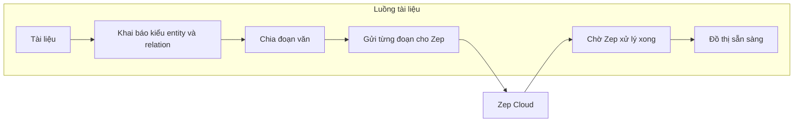
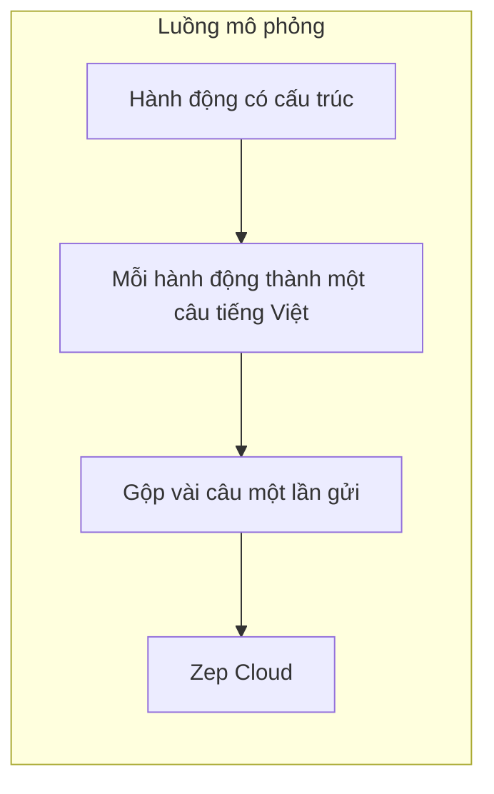

# Kiến trúc ingest đồ thị: Zep (MiroFish) và Graphiti + Neo4j (Semantic-Reasoning-Agent)

## Nguyên tắc của tài liệu này

- **Chỉ coi là “chắc chắn”** những gì **đọc được từ code trong repo** (gọi API nào, tham số nào, thứ tự bước nào).
- **Không suy ra** cách Zep hay thư viện Graphiti **xử lý nội bộ** (pipeline LLM, fusion entity, v.v.): repo **không** chứa mã nguồn của hai dịch vụ/thư viện đó; phần đó **không được khẳng định ở đây**.
- Chỗ nào chỉ là **mục đích comment/docstring trong repo** (ví dụ docstring của `zep_tools` mô tả hybrid search) sẽ được **ghi rõ là trích từ docstring**, không đóng vai “sự thật kỹ thuật đã kiểm chứng”.

---

## Bạn đọc được gì ở đây?

Hai phần trong repo đều có **đồ thị tri thức** (nút–cạnh), nhưng **không phải hai “sản phẩm cùng chức năng đặt cạnh nhau”**:

| | **Zep (trong MiroFish_vie)** | **Graphiti + Neo4j (trong Semantic-Reasoning-Agent)** |
|---|------------------------------|--------------------------------------------------------|
| **Vai trò tổng thể** | Một **dịch vụ** lo trọn gói: lưu đồ thị + **trích xuất từ văn** + (tuỳ chọn) khung kiểu + tìm kiếm | **Không** sinh hay chỉnh ontology; là **lớp runtime** trên Neo4j: **ghi** snapshot/chunk vào DB và **phục vụ truy vấn / tìm trong đồ thị** |

**Ontology trong SR Agent** (các entity, relation, tài liệu đã publish) được định nghĩa và quản lý ở **pipeline ontology / snapshot** — Graphiti chỉ **nhận bản đã định nghĩa** để materialize và đồng bộ, chứ **không phải “engine tạo ontology”**.

Bài này giải thích **Zep và Graphiti mỗi thứ làm được gì**, rồi kể **hai luồng** trong MiroFish và **cách SR Agent đưa ontology + văn vào Neo4j**. Tên file chỉ ở **phụ lục**.

---

## Zep Cloud — trong repo MiroFish chỉ thấy gì?

Ở **MiroFish_vie**, code **không** triển khai Neo4j hay logic trích entity trong máy. Nó gọi SDK **`zep_cloud`** tới **Zep Cloud**. Repo **không** chứa mã xử lý bên trong Zep; vì vậy **không thể** mô tả chi tiết “Zep làm bằng LLM hay không” từ đây.

Điều **đọc được từ code** là app:

1. Gọi **`client.graph.create`** để tạo đồ thị (có `graph_id`).
2. Gọi **`client.graph.set_ontology`** sau khi build class động từ JSON ontology (kiểu entity/relation phía Zep SDK).
3. Gửi văn vào bằng **`EpisodeData` + `add_batch`** hoặc **`graph.add`** (luồng mô phỏng), rồi **poll** `episode.get_by_graph_id` cho đến khi `processed`.
4. Đọc kết quả bằng API lấy nodes/edges (wrapper trong code có `fetch_all_nodes` / `fetch_all_edges`).

**“Ontology” trong Zep (ở đây)** = schema gửi qua API để **ràng buộc kiểu** entity/edge theo SDK — đúng với code `set_ontology`; đó **không** phải rule engine if–then trong app.

**Tìm kiếm:** trong `zep_tools.py`, docstring của `search_graph` **ghi** là dùng hybrid (semantic + BM25) — đó là **mô tả trong repo**, không phải benchmark độc lập.

**Giới hạn:** mọi thứ khác (chất lượng trích xuất, model nội bộ Zep) **không** có trong repo này.

---

## Graphiti + Neo4j — trong repo SR Agent chỉ thấy gì?

**Neo4j:** `GraphitiGateway` dùng driver Neo4j (`graphiti_gateway.py`).

**Graphiti (SDK):** code import `graphiti_core.Graphiti`, gọi **`add_episode`**, **`add_triplet`** (qua `upsert_edge`), và **`search_`** (qua wrapper `GraphitiGateway.search`). Chi tiết **bên trong** `graphiti_core` **không** nằm trong repo này.

**Việc ontology được “tạo” ở đâu:** không phải trong Graphiti — **`OntologyGraphPublisher`** nhận `PublishedOntologySnapshot` (đã có sẵn entities/relations) rồi gọi gateway để **ghi** vào Neo4j và **ingest_episode** cho chunk tài liệu. Đó là thứ tự **đọc được trong code**.

**Trong repo này, Graphiti được dùng để:**

| Việc | Chứng trong code |
|------|------------------|
| Ghi triplet / entity | `GraphitiGateway.upsert_edge`, `upsert_node` → `add_triplet` / episode JSON |
| Ingest đoạn văn | `GraphitiGateway.ingest_episode` → `graphiti.add_episode` |
| Tìm trong đồ thị | `GraphitiGateway.search` → `graphiti.search_` — tool `graphiti.search`, `HybridRetrievalService` có nhánh dùng gateway |
| Xóa partition | `delete_group_data` — Cypher `MATCH (n) WHERE n.group_id = ... DETACH DELETE` |

**Không suy thêm:** repo **không** khẳng định Graphiti “chỉ để query”; ghi (`add_episode`, triplet) **có trong gateway**.

---

## Trong MiroFish_vie: hai cách “đổ” dữ liệu vào Zep

### Cách 1 — Từ tài liệu lớn (build đồ thị cho một dự án)

Luồng người dùng hình dung được:

1. Người dùng **tải tài liệu** → hệ thống có thể **sinh ontology** (danh sách kiểu thực thể / kiểu quan hệ gợi ý).
2. App **tạo một đồ thị Zep mới**, **áp ontology** lên đồ thị đó (để Zep biết “khung” domain).
3. **Chia nhỏ** file văn thành nhiều đoạn (chunk), **gửi lần lượt** vào Zep dưới dạng episode văn bản.
4. App **chờ** Zep báo các episode đã **xử lý xong** rồi mới coi như build xong.
5. Kết quả: một đồ thị có **nút** (tên, loại, tóm tắt, thuộc tính) và **cạnh** (quan hệ, có khi có dòng “fact” mô tả và thời điểm hiệu lực nếu có).

**Ý nghĩa:** đây là luồng **đọc tài liệu → đồ thị có kiểu**, ontology đóng vai **schema** cho Zep.

### Cách 2 — Từ mô phỏng mạng xã hội (agent làm gì thì ghi ra chữ)

Ở đây không chia file PDF mà có **hàng ngàn hành động có cấu trúc** (đăng bài, thích, follow…). Ta không cần chuỗi JSON phức tạp gửi thẳng Zep mà làm một việc đơn giản:

- Mỗi hành động được **viết thành một câu tiếng Việt tự nhiên**, ví dụ: `TênAgent: Đã thích bài viết của X: "..."`.
- Vài câu được **gộp một lô** rồi gửi Zep như **một episode văn bản** (nhiều dòng trong một lần gửi).

**Ý nghĩa (theo comment trong code `zep_graph_memory_updater`):** mỗi hành động thành **một dòng mô tả ngôn ngữ tự nhiên** để Zep nhận **chuỗi văn**, không gửi JSON hành động thô.

Ontology **có thể đã có** từ lúc tạo đồ thị trước đó; riêng lớp “ghi nhớ mô phỏng” không nhất thiết đặt ontology lại — chủ yếu dựa vào **mô tả ngôn ngữ**.

### Sau khi có đồ thị: lọc và hỏi

- **Lọc nút:** logic trong `zep_entity_reader` **bỏ** nút nếu sau khi bỏ nhãn `Entity` và `Node` không còn nhãn nào (xem vòng lặp `custom_labels`).
- **Hỏi đồ thị:** `zep_tools.search_graph` gọi `client.graph.search` (docstring nói hybrid); có nhánh fallback `_local_search` khi lỗi — đọc trong `zep_tools.py`.

---

## Trong Semantic-Reasoning-Agent: ontology ở đâu, Graphiti làm gì?

**Ontology** (entity, relation, bản publish) được chuẩn bị **trước** — không phải do Graphiti “nghĩ ra”. Khi snapshot đã sẵn, luồng điển hình là:

1. **Quan hệ trong snapshot** được **ghi thẳng** vào Neo4j qua Graphiti (**triplet**: hai nút + cạnh có kiểu) — đây là **đồng bộ tri thức đã khai báo**, không phải bước thiết kế ontology.
2. **Entity chưa xuất hiện trong quan hệ** có thể được **tạo nút** qua một episode có payload có cấu trúc (materialize).
3. **Chunk văn** được đưa qua `ingest_episode` trong `ontology_graph_publisher` — **số lượng chunk** bị giới hạn bằng `MAX_CHUNK_EPISODES` trong code.

**Đối chiếu cách gọi API:** app MiroFish chỉ **đưa văn + (tuỳ chọn) schema Zep + chờ processed**. SR Agent đưa **`PublishedOntologySnapshot`** vào `OntologyGraphPublisher` rồi gọi `GraphitiGateway` — hai chỗ **không** mirror nhau hàng API.

---

## Bảng so sánh ngắn

| Câu hỏi | Zep (MiroFish) | SR Agent: ontology vs Graphiti |
|--------|----------------|--------------------------------|
| Đồ thị nằm đâu? | Cloud Zep | Neo4j (qua Graphiti) |
| **Ai “tạo” ontology?** | App có thể sinh schema + nạp vào Zep | **Không phải Graphiti** — ontology từ pipeline publish/snapshot |
| Trích từ văn (ngoài triplet snapshot)? | App chỉ gọi Zep; **implementation Zep không có trong repo** | `ingest_episode` → `graphiti.add_episode` — **implementation trong `graphiti_core`**, không có trong repo |
| Quan hệ đã biết chắc trong snapshot? | Phụ thuộc model Zep sau ingest | **Ghi trực tiếp** triplet vào Neo4j |
| Truy vấn | Docstring `zep_tools.search_graph`: hybrid (semantic + BM25) | `GraphitiGateway.search` + tool `graphiti.search` trong registry (`agent_capability_service` có default tool order gồm `graphiti.search`) |
| Phân vùng | Theo graph Zep | Theo `group_id` |

---

## Điều có thể học từ cách MiroFish tổ chức (không nhầm với Graphiti)

- **Chia nhỏ văn + gửi theo lô + chờ xử lý xong** — pattern vận hành pipeline (áp dụng được cho ingest episode vào Neo4j).
- **Chuẩn hoá sự kiện có cấu trúc thành câu tự nhiên** trước khi đưa vào model đọc chữ — không gắn với Zep hay Graphiti cụ thể.
- **Không** đồng nhất hai stack chỉ vì cùng có khái niệm “episode”: gọi API Zep ≠ gọi `GraphitiGateway` trong repo — bảng trên và mục “trong repo chỉ thấy gì” nêu **chứng cứ file**.

Điều **không** sao chép được từ MiroFish: **model trích xuất bên trong Zep**.

---

## Gợi ý hybrid (nếu sau này cần)

Nếu một phần dự án vẫn dùng Zep và một phần dùng Neo4j, nên có **một lớp điều phối** (workspace → backend đồ thị nào) để không trộn ID Zep với `group_id` Neo4j.

---

## Phụ lục: chỗ nào trong repo làm việc đó (khi cần đọc code)

Chỉ dùng khi bạn **debug hoặc chỉnh sửa** — không cần nhớ để hiểu kiến trúc phía trên.

| Việc | Đường dẫn trong repo |
|------|----------------------|
| API tạo ontology / build đồ thị MiroFish | `MiroFish_vie/backend/app/api/graph.py` |
| Tạo graph Zep, ontology, chunk, batch episode, chờ xử lý | `MiroFish_vie/backend/app/services/graph_builder.py` |
| Mô phỏng → câu tiếng Việt → gửi Zep theo lô | `MiroFish_vie/backend/app/services/zep_graph_memory_updater.py` |
| Lọc nút theo nhãn kiểu | `MiroFish_vie/backend/app/services/zep_entity_reader.py` |
| Tìm kiếm / đọc đồ thị cho agent | `MiroFish_vie/backend/app/services/zep_tools.py` |
| `GraphitiGateway` (add_episode, search, triplet, delete_group) | `apps/backend/src/semantic_reasoning_agent/infrastructure/graphiti/graphiti_gateway.py` |
| Đồng bộ snapshot ontology + chunk vào Neo4j | `apps/backend/src/semantic_reasoning_agent/services/ontology_graph_publisher.py` |
| Tool search đồ thị | `apps/backend/src/semantic_reasoning_agent/tools/graph/graphiti_search_tool.py` |
| Retrieval có nhánh Graphiti | `apps/backend/src/semantic_reasoning_agent/services/hybrid_retrieval_service.py` |
