# System Flow — Semantic Reasoning Agent

> **Mục đích.** Tài liệu luồng hệ thống chuẩn production cho cả BE và FE. Các sơ đồ Mermaid có thể render trực tiếp trên GitHub / các IDE hỗ trợ Mermaid. Viết cho engineer mới on-board, reviewer kiến trúc, và on-call.
>
> **Phạm vi.** Mô tả runtime hiện tại (FastAPI + Celery + Next.js 14 App Router) theo nguyên lý **tool-first, workflow-centric, ontology-guided** trong `AGENTS.md`. Bám sát code thực tế tại `apps/backend/src/semantic_reasoning_agent/**` và `apps/frontend/src/**`.
>
> **Cập nhật khi.** (1) thêm service mới trong `core/container.py`; (2) thêm router mới trong `entrypoints/router.py`; (3) thêm tool mới trong `tools/`; (4) đổi page / shared API ở FE; (5) thay đổi backing store (Postgres/Redis/Neo4j/MinIO/Qdrant).

---

## 0. Mục lục

- [1. System Context (L1)](#1-system-context-l1)
- [2. Container View (L2)](#2-container-view-l2)
- [3. Backend — Layered Architecture](#3-backend--layered-architecture)
- [4. Backend — Module & API Surface](#4-backend--module--api-surface)
- [5. Backend — Core Runtime Flows](#5-backend--core-runtime-flows)
  - [5.1 Chat / Task Resolution (tool-first loop)](#51-chat--task-resolution-tool-first-loop)
  - [5.2 Streaming SSE flow](#52-streaming-sse-flow)
  - [5.3 Public `/tasks/resolve`](#53-public-tasksresolve)
  - [5.4 Document ingestion pipeline](#54-document-ingestion-pipeline)
  - [5.5 Ontology build → review → publish](#55-ontology-build--review--publish)
  - [5.6 Tool calling lifecycle (§9 contract)](#56-tool-calling-lifecycle-9-contract)
  - [5.7 Runtime audit persistence](#57-runtime-audit-persistence)
- [6. Frontend — Route Map & Layout](#6-frontend--route-map--layout)
- [7. Frontend — Data Flow & Streaming](#7-frontend--data-flow--streaming)
- [8. Cross-cutting Concerns](#8-cross-cutting-concerns)
- [9. Production Readiness Checklist](#9-production-readiness-checklist)

---

## 1. System Context (L1)

Mô tả các actor và hệ thống ngoài tương tác với platform.

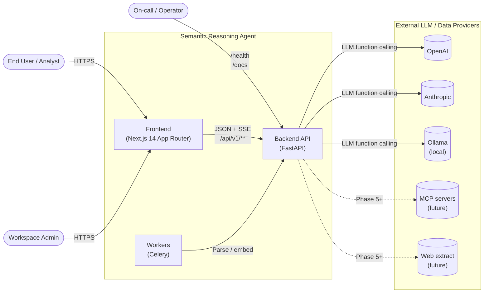

---

## 2. Container View (L2)

Các container (process / infra) đang chạy trong `docker-compose.yml`.

```mermaid
flowchart TB
    classDef app fill:#dde9ff,stroke:#3b5bdb,color:#102a6b
    classDef store fill:#fff4d6,stroke:#c9a227,color:#5a4200
    classDef ext fill:#eee,stroke:#888,color:#333

    client["Browser (React + React Query)"]:::app

    subgraph APP["Application Plane"]
        fe["frontend<br/>Next.js 14 :3000"]:::app
        api["api<br/>FastAPI + Uvicorn :8000"]:::app
        worker["worker<br/>Celery"]:::app
    end

    subgraph DATA["Data Plane"]
        pg[("postgres :5432<br/>System of record")]:::store
        redis[("redis :6379<br/>broker + result backend")]:::store
        neo4j[("neo4j :7687<br/>graph projection")]:::store
        minio[("minio :9000<br/>object store")]:::store
        qdrant[("qdrant :6333<br/>vector index (planned)")]:::store
    end

    subgraph LLM["LLM Adapters"]
        oa[("OpenAI")]:::ext
        an[("Anthropic")]:::ext
        ol[("Ollama")]:::ext
    end

    client -->|fetch /api/v1/**| fe
    fe -->|SSR proxy or<br/>client fetch| api
    api <-->|SQLAlchemy| pg
    api <-->|blobs| minio
    api -->|enqueue| redis
    worker -->|consume| redis
    worker <-->|SQLAlchemy| pg
    worker <-->|blobs| minio
    api -->|Graphiti sync<br/>(optional)| neo4j
    worker -->|Graphiti sync<br/>(optional)| neo4j
    api -->|function calling| LLM
    worker -->|LLM extraction| LLM
    api -.->|vector index<br/>(planned)| qdrant
```

**Deployment nguyên tắc:**

- `api` và `worker` dùng **cùng một Docker image** (`apps/backend/Dockerfile`), khác `command`. `worker-entrypoint.sh` chạy Celery; `entrypoint.sh` chạy Uvicorn + Alembic upgrade qua `AlembicService` trong `main.py` lifespan.
- `frontend` chạy Next.js dev mode trong compose; production build bằng `next build` trong cùng Dockerfile (phase sau).
- Cả `api` và `worker` đều phụ thuộc `postgres`, `redis`, `neo4j`, `minio`, `qdrant` đều `service_healthy` trước khi khởi động.

---

## 3. Backend — Layered Architecture

Mỗi module backend có một vị trí rõ ràng. Dòng dữ liệu luôn đi từ **entrypoint → service → port → adapter/persistence**. Services không bao giờ import router, và port không bao giờ import adapter ngược chiều.

```mermaid
flowchart TB
    classDef boundary fill:#eaf7ff,stroke:#1c7ed6
    classDef svc fill:#f3f0ff,stroke:#7048e8
    classDef port fill:#fff0f6,stroke:#d6336c
    classDef infra fill:#f1f3f5,stroke:#495057
    classDef db fill:#fff4d6,stroke:#c9a227

    subgraph Entrypoints["entrypoints/v1/ — FastAPI routers"]
        rChat["chat.py"]:::boundary
        rTasks["tasks.py"]:::boundary
        rDocs["documents.py"]:::boundary
        rOnto["ontology.py"]:::boundary
        rTools["tools.py"]:::boundary
        rAgents["agents.py / agent_profiles.py"]:::boundary
        rSettings["settings.py / provider_models.py"]:::boundary
        rWf["workflows.py"]:::boundary
        rRetr["retrieval.py"]:::boundary
        rAuth["auth.py"]:::boundary
        rKp["knowledge_packs.py"]:::boundary
    end

    subgraph Services["services/ — use cases"]
        chatSvc["ChatStreamService"]:::svc
        trSvc["TaskRuntimeService<br/>orchestrator"]:::svc
        interp["TaskInterpreter"]:::svc
        ground["OntologyGroundingService"]:::svc
        wfSel["WorkflowSelector"]:::svc
        agentic["AgenticLoopService"]:::svc
        toolRt["ToolRuntime"]:::svc
        toolReg["ToolRegistry"]:::svc
        ctxAsm["ContextAssemblerService"]:::svc
        judge["EvidenceJudge"]:::svc
        conflict["ConflictEngine"]:::svc
        router["OutputRouter"]:::svc
        audit["RuntimeAuditService"]:::svc
        convSvc["ConversationService"]:::svc
        retrSvc["RetrievalService"]:::svc
        ontoSvc["OntologyService"]:::svc
        docSvc["DocumentService"]:::svc
        modelCfg["ModelConfigService"]:::svc
        profileSvc["AgentProfileService"]:::svc
        kpSvc["KnowledgePackService"]:::svc
    end

    subgraph Ports["ports/ + domain/contracts — interfaces"]
        pObj["ObjectStorePort"]:::port
        pOntoEx["OntologyExtractorPort"]:::port
        pTool["ToolEnvelope / ToolResult"]:::port
        pEv["Evidence contract"]:::port
        pLLM["LLMMessage / LLMResponse"]:::port
    end

    subgraph Infra["infrastructure/ — adapters"]
        llmReg["llm/registry.py<br/>(OpenAI / Anthropic / Echo)"]:::infra
        ontoLLM["ontology/llm_extractor.py"]:::infra
        graphiti["graphiti/graphiti_gateway.py"]:::infra
        storDb["storage/database_blob_store.py"]:::infra
        storMin["storage/minio_blob_store.py"]:::infra
        vec["vector/token_vector_backend.py"]:::infra
        converters["documents/converters/*<br/>(MarkItDown)"]:::infra
    end

    subgraph Persist["persistence/ + workers"]
        orms["models/* ORM"]:::db
        repos["repositories/*"]:::db
        dbm["DatabaseManager"]:::db
        disp["workers/task_dispatcher.py"]:::infra
        celery["workers/celery_app.py<br/>worker_tasks.py"]:::infra
    end

    Entrypoints --> Services
    Services --> Ports
    Services --> Persist
    Ports --> Infra
    Services --> Infra
    disp --> celery
    celery --> Services
```

**Đọc sơ đồ:**

- **Entrypoints** chỉ cầm Pydantic schema, gọi service qua `Depends(get_*_service)` từ `entrypoints/dependencies.py`.
- **Services** là nơi chứa logic nghiệp vụ. `TaskRuntimeService` là orchestrator chính cho chat và `/tasks/resolve`.
- **Ports + domain contracts** là đường biên kỹ thuật. Adapter (infrastructure) chỉ implement port, không được service gọi trực tiếp class cụ thể.
- **Persistence** dùng SQLAlchemy ORM + `DatabaseManager` session factory. Celery worker chia image với API, nhưng **không chia process**: mỗi worker task khởi động lại `get_app_container()` (xem `worker_tasks.py`).

---

## 4. Backend — Module & API Surface

Bản đồ `/api/v1/**` tới service layer. Dùng để rà soát quyền truy cập và tầng abstraction.

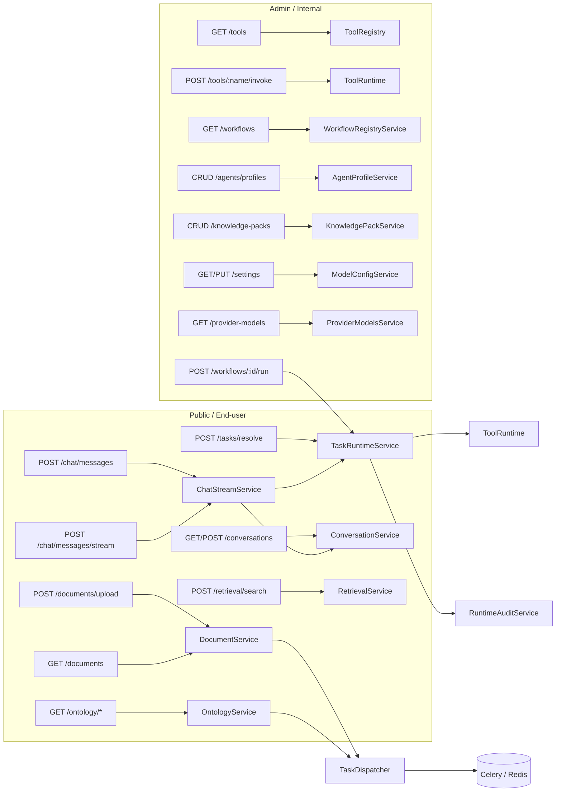

**Route ownership** — xem `apps/backend/src/semantic_reasoning_agent/entrypoints/router.py` (17 routers). Route nào có `openapi_extra=INTERNAL_ROUTE` được coi là admin-only; FE public chỉ gọi route `PUBLIC_ROUTE`.

**Wiring DI** — `core/container.py → AppContainer` là composition root duy nhất. Test có thể override bằng cách thay `get_app_container.cache_clear()` + inject container giả.

---

## 5. Backend — Core Runtime Flows

### 5.1 Chat / Task Resolution (tool-first loop)

Đây là flow xương sống cho câu hỏi người dùng. `ChatStreamService.send_message` KHÔNG chứa logic LLM; nó chỉ normalize provider/model, rồi delegate sang `TaskRuntimeService.resolve_chat_request`. Toàn bộ tool execution và answer composition nằm trong `TaskRuntimeService.resolve_request`.

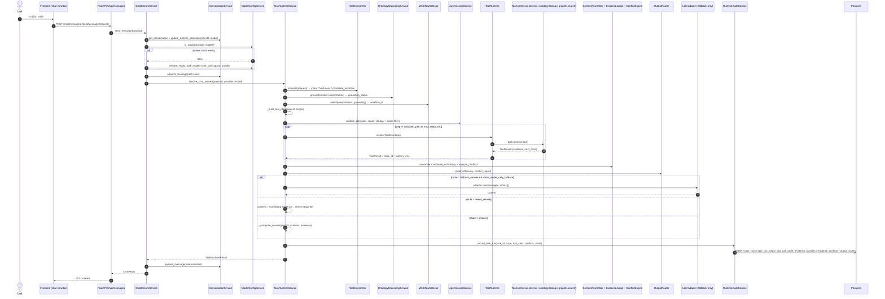

**Điểm design quan trọng:**

- **Tool-first, không LLM-first.** LLM adapter chỉ được gọi ở nhánh `fallback_answer` khi `allow_model_only_fallback=true` trong `AgentProfile.evidence_policy`. Mặc định answer được compose deterministic từ citations + graph evidence (`_compose_answer`).
- **Scope policy** (`AgentExecutionScope`) được build 1 lần đầu request dựa trên `AgentProfile` + `KnowledgePack`. Mọi tool step đi qua filter này.
- **Audit là mandatory.** `RuntimeAuditService` ghi đủ `task_run`, từng `task_run_step`, `tool_call_audit`, `evidence_bundle`, `evidence_conflicts`, `output_route` trong 1 transaction.
- **Bounded loop.** `AgenticLoopService.max_steps_for` hiện là 4 khi `use_retrieval=true`, 3 khi không. Phải nâng lên planner-driven loop khi thêm tool family mới (xem §9 roadmap).

### 5.2 Streaming SSE flow

`POST /chat/messages/stream` trả `text/event-stream`. Phía FE dùng `streamMessage()` tự parse SSE (không dùng `EventSource` vì cần POST body).

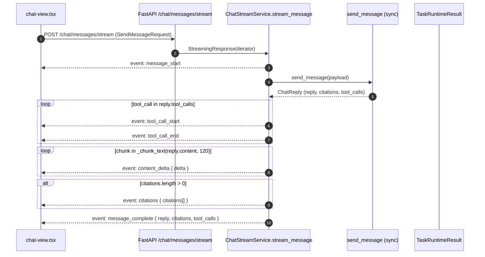

> **Chú ý production.** Hiện tại streaming là **fake-streaming**: BE compute xong mới chunk text 120 ký tự. Khi thêm LLM token streaming thật, chuyển `AnthropicAdapter` / `OpenAIAdapter` sang streaming mode và emit `content_delta` từ adapter.

### 5.3 Public `/tasks/resolve`

Endpoint primary cho integration khác (không cần conversation):

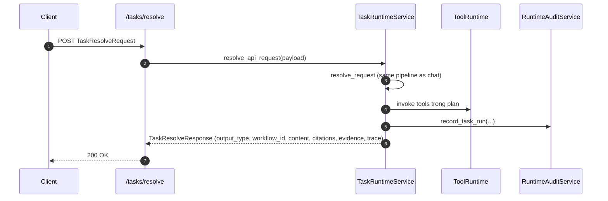

Điểm khác so với chat: không append vào conversation, không update runtime selection, không fallback LLM (vì không có `provider`/`model` guarantee từ ConversationService).

### 5.4 Document ingestion pipeline

Document là async job. Upload sync → Celery chạy 2 hoặc 4 sub-step tùy `ingestion_mode`.
Các step được track bởi `DocumentJobORM`:

- Luôn có: `convert_markdown`, `store_artifacts`
- Chỉ khi mode là `retrieval` hoặc `both`: `build_chunks`, `index_chunks`

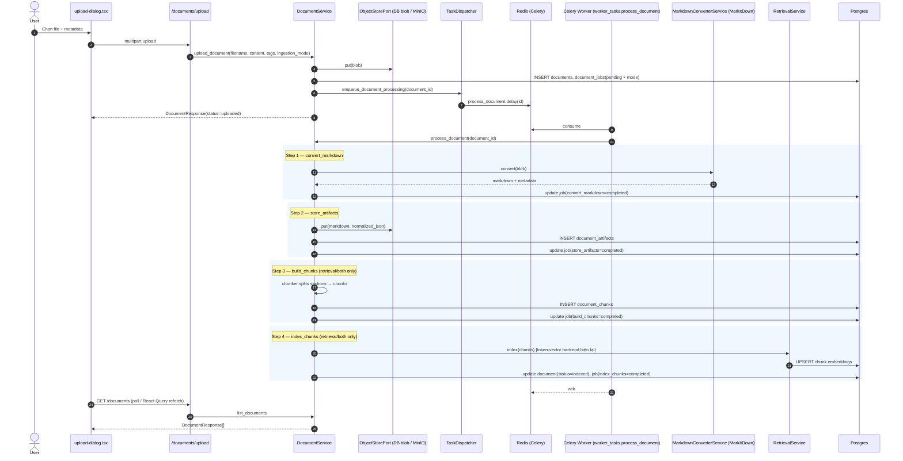

**Quan điểm production:**

- Celery restart phải **idempotent** theo mode; mỗi step update status riêng. Nếu worker chết, retry tiếp tục từ step pending kế.
- Object store hiện hỗ trợ 2 backend (`DatabaseBlobStore`, `MinIOBlobStore`) sau cùng 1 port — migrate bằng cách đổi `OBJECT_STORE_BACKEND` env.
- Reprocess (`POST /documents/:id/reprocess`) reset job về pending và re-enqueue.

### 5.5 Ontology build → review → publish

Ontology có 3 giai đoạn tách biệt: **build (async)** → **review (interactive)** → **publish (transaction + optional Graphiti sync)**.

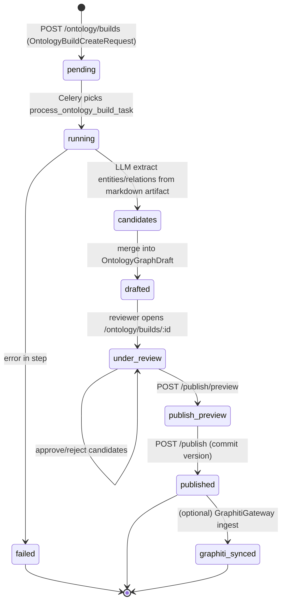

Chi tiết build step (xem `ONTOLOGY_BUILD_STEP_NAMES`):

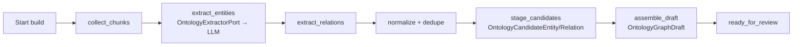

Runtime `OpenDomainLLMExtractor` hiện chạy theo mô hình **2-stage + chunked**:

- Chia markdown thành các cửa sổ chồng lấp (`chunk_for_extraction`, mặc định window `6000`, overlap `500`, tối đa `ONTOLOGY_EXTRACTION_MAX_CHUNKS`).
- Với mỗi chunk:
  - Call 1: extract `domain + entities` (JSON mode, `reasoning_effort` thấp).
  - Call 2: extract `relations` với whitelist `resolution_key` đã merge.
- Kết quả được dedupe toàn cục theo `resolution_key` (entities) và `(source, type, target)` (relations).
- Khi parse JSON lỗi hoặc bị `finish_reason=max_tokens`, extractor retry 1 lần với prompt rút gọn và ghi lỗi vào `safe_trace.errors`.

**Publish transaction** phải atomic trên Postgres; Graphiti sync là **best-effort** (không làm fail publish nếu Neo4j down). Draft không bao giờ được dùng làm runtime knowledge — chỉ `OntologyVersionORM.state='published'` mới được `ontology.lookup` đọc.

### 5.6 Tool calling lifecycle (§9 contract)

Xem `apps/backend/src/semantic_reasoning_agent/domain/contracts/tool_envelope.py`. Mỗi lần tool chạy:

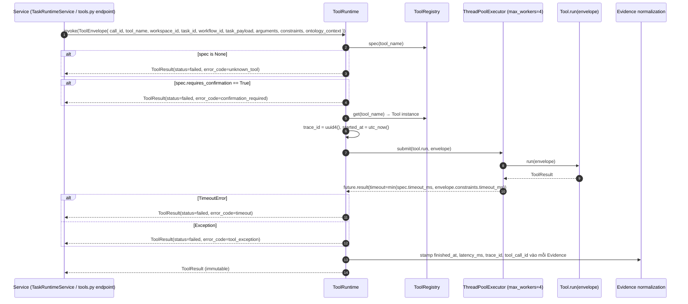

**Contract bất biến:**

- Service KHÔNG được tự validate schema; ToolRuntime cũng không validate `arguments` (tool tự raise khi thiếu). Validation structural do Pydantic ở API boundary.
- Mọi `Evidence` xuất ra phải carry `provenance.tool_call_id = envelope.call_id`.
- `spec.requires_confirmation = true` ⇒ runtime **luôn fail** nếu không có confirmation token. Khi thêm `graph.publish` tool loại write, đây là cửa chặn duy nhất.

### 5.7 Runtime audit persistence

Bảng audit được thêm ở migration `20260422_add_task_runtime_audit_tables.py`. Mỗi `resolve_request` ghi 1 transaction:

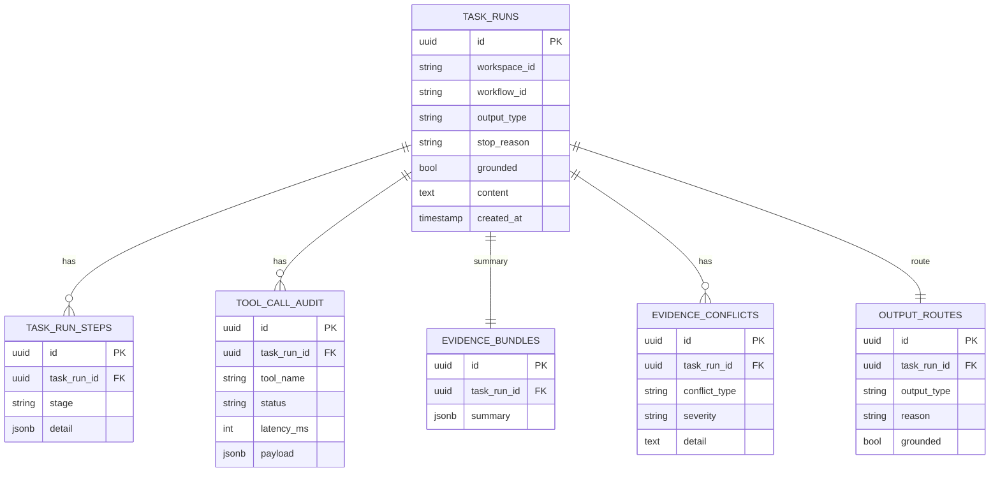

Audit này là **foundation cho observability**: mọi debug / replay / compliance đều đi qua `task_runs.id`. FE nên surface `task_id` cho admin để cross-reference.

---

## 6. Frontend — Route Map & Layout

FE là Next.js 14 App Router. Sidebar điều hướng được define ở `components/layout/app-sidebar.tsx → getNavGroups()`, feature-gated bởi `useCapabilities()`.

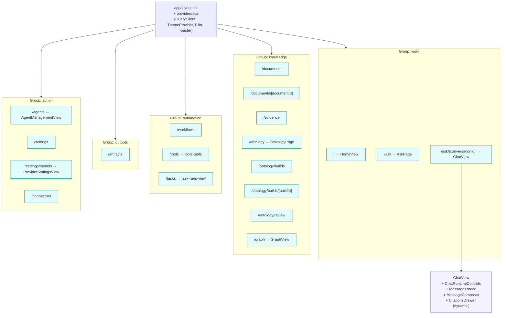

Nguyên tắc:

- **Page = thin wrapper** chỉ render component nặng (ví dụ `HomePage` → `<HomeView/>`). Logic và data-fetch nằm trong component.
- **Dynamic import** cho component chỉ cần lúc user tương tác (ví dụ `CitationsDrawer` trong `ChatView` dùng `next/dynamic` với `ssr: false`).
- **Capability gating** — sidebar dùng `useCapabilities()` để ẩn route khi workspace không bật. Tránh nhảy 404 cho user thường.

---

## 7. Frontend — Data Flow & Streaming

FE **không dùng global store cho server state**; chỉ dùng Zustand cho `workspaceStore` và `languageStore`. Server state đi qua React Query (`@tanstack/react-query`) với `staleTime: 10_000`, `refetchOnWindowFocus: false`, `retry: 1`.

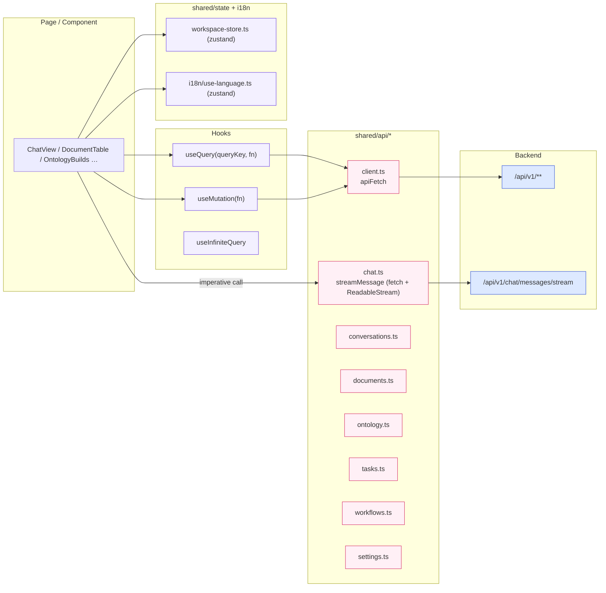

**Streaming handshake trong `chat-view.tsx`:**

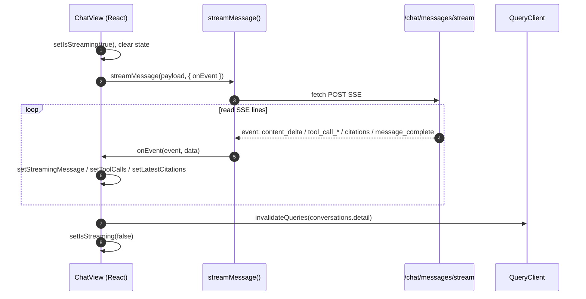

**Nguyên tắc production FE:**

- Server state **chỉ** invalidate bằng `queryKeys` (trong `shared/query/keys.ts`). Không `queryClient.setQueryData` trừ khi cần optimistic.
- Mọi fetch đi qua `apiFetch` để lấy `ApiError` chuẩn hóa (status + message + body). Component bắt `ApiError` để toast i18n.
- SSE stream parse thủ công vì cần POST body — browser `EventSource` không hỗ trợ. Nếu migrate sang fetch-event-stream library, giữ signature `streamMessage(payload, { onEvent })`.
- i18n: mọi string hiển thị đi qua `useI18n().t`. Script `scripts/check-i18n-coverage.ts` đảm bảo coverage 2 locale (en, vi).

---

## 8. Cross-cutting Concerns

| Concern | Pattern hiện tại | File chính |
|---|---|---|
| **Dependency injection** | Single composition root `AppContainer` + `@lru_cache` | `core/container.py` |
| **Config** | `pydantic-settings` `Settings`, env-driven | `core/config.py` |
| **Time** | Tất cả `utc_now()` tập trung ở `core/time.py` để mock test | `core/time.py` |
| **Migrations** | Alembic auto-upgrade khi API boot (lifespan) | `main.py` + `services/alembic_service.py` |
| **Authn/Authz** | `/auth/*` đã có router; workspace/profile gate trong `TaskRuntimeService._build_execution_scope` | `entrypoints/v1/auth.py`, `services/agent_profile_service.py` |
| **LLM routing** | `ModelConfigService.resolve_ready_task_model(task_type, workspace, profile)` + `AdapterRegistry` | `services/model_config_service.py`, `infrastructure/llm/registry.py` |
| **Secrets** | `SecretService` đọc/ghi qua `DatabaseSecretRepository` (KMS-ready port) | `services/secret_service.py` |
| **Idempotency** | Document job có 4 step có thể retry; ontology build có `OntologyBuildStepORM` | `documents/service.py`, `services/ontology_service.py` |
| **Observability** | `RuntimeAuditService` là audit trail. Logging chưa structured — cần thêm. | `services/runtime_audit_service.py` |
| **Error boundary FE** | `app/error.tsx` + `ApiError` | `apps/frontend/src/app/error.tsx` |

---

## 9. Production Readiness Checklist

> Dùng checklist này khi review release. Đánh dấu ✅ nếu đạt, ⚠️ nếu cần hành động.

### Backend

- [ ] **Alembic head hợp nhất.** Hiện có `20260422_merge_all_heads_for_dev_runtime.py` — kiểm tra `alembic heads` chỉ còn 1 head trước khi deploy.
- [ ] **Container healthcheck.** `/health` đã có, nhưng nên bổ sung `/readyz` check DB + Redis + Neo4j + MinIO ready.
- [ ] **CORS.** `settings.cors_allow_origins` phải set cụ thể domain prod, không dùng `*` khi `allow_credentials=true`.
- [ ] **Auth.** `/auth/*` cần middleware bảo vệ route admin (`INTERNAL_ROUTE`). Xác nhận mọi route có session guard.
- [ ] **Rate limit.** Chưa có. Thêm ở reverse proxy (nginx / caddy) trước `/chat/*`, `/tasks/resolve`, `/tools/*/invoke`.
- [ ] **LLM timeout & retry.** `ToolRuntime` có timeout; adapter cần retry policy đồng nhất (exponential backoff với max attempts).
- [ ] **Tool confirmation gate.** Đảm bảo mọi tool `side_effect_level >= write_external` có `requires_confirmation=true`.
- [ ] **Celery isolation.** `worker-entrypoint.sh` nên set `--concurrency`, `--max-tasks-per-child` để tránh leak ở worker converter/indexing.
- [ ] **Audit retention.** Thêm TTL/partition cho `task_runs` + `tool_call_audit` (dữ liệu lớn).
- [ ] **Structured logging.** Chuyển logging sang JSON + correlation id = `trace_id` từ `ToolResult.meta`.
- [ ] **Metrics.** Export Prometheus metrics: tool_latency, tool_status_count, task_run_count theo `output_type`, queue depth Celery.
- [ ] **Secret rotation.** `SecretService` hiện đọc DB plain; migrate sang external KMS (Vault / cloud KMS) bằng cách swap `DatabaseSecretRepository`.
- [ ] **Backups.** Postgres WAL archive + snapshot MinIO + Neo4j dump theo lịch.

### Frontend

- [ ] **Env.** `NEXT_PUBLIC_API_BASE_URL` và `INTERNAL_API_BASE_URL` đúng cho mỗi env (dev / staging / prod).
- [ ] **ESLint + typecheck** pass trên CI (có `apps/frontend/.eslintrc.json`).
- [ ] **i18n coverage.** `scripts/check-i18n-coverage.ts` pass cho en + vi.
- [ ] **Error boundary.** `app/error.tsx` có, thêm telemetry track (Sentry / PostHog) cho uncaught error.
- [ ] **Accessibility.** Kiểm tra focus trap trong `CitationsDrawer`, `ChatView` keyboard nav, `Toaster` `containerAriaLabel`.
- [ ] **Streaming reliability.** `streamMessage` hiện không cancel được — thêm `AbortController` và hủy khi user điều hướng rời ChatView.
- [ ] **Caching.** React Query `staleTime` 10s hiện tại OK cho list; với `conversations.detail` nên invalidate sau `message_complete` (đã làm trong ChatView — verify lại).
- [ ] **Bundle size.** Dynamic-import các page nặng (graph, ontology) giống `CitationsDrawer`. Xem output `next build --profile`.
- [ ] **CSP + security headers** ở reverse proxy trước Next.js.

### Dữ liệu / Runtime

- [ ] **Published ontology là runtime truth.** Không code path nào đọc draft khi `ontology.lookup` (đã tuân theo §3 của `docs/architecture/query-runtime-improvements.md`).
- [ ] **Graphiti optional.** Cả publish và chat phải chạy được khi `NEO4J_ENABLED=false`.
- [ ] **Fallback LLM có policy.** `AgentProfile.evidence_policy.allow_model_only_fallback` default nên là `false` cho profile external-facing.

---

## Appendix A — Glossary

- **Task** — 1 yêu cầu cần runtime giải quyết, không bắt buộc là câu hỏi chat. Có `task_id` UUID, được audit.
- **Workflow** — kế hoạch thực thi có tên + version. Hiện chỉ có `task.resolve.chat`. Mục tiêu dài hạn: thêm workflow deterministic (ingestion, publish, artifact).
- **Tool** — capability nguyên tử conform §9 contract. Hiện có `retrieval.internal`, `ontology.lookup`, `graphiti.search` (khi enable), `graphiti.ingest`.
- **Evidence** — unit dữ liệu có citation. Luôn gắn `provenance.tool_call_id` và `source_type` ∈ `{internal_chunk, graph_node, graph_edge, web_page, mcp_result, generated_artifact}`.
- **Agent Profile** — template policy (allowed tools, knowledge pack scope, evidence policy, capability preset). Conversation gắn 1 profile.
- **Knowledge Pack** — bộ document scope cho agent. Được resolve trong `_build_execution_scope`.

## Appendix B — Lệnh hữu ích

```bash
# Backend - local dev
docker compose up --build

# Migrate thủ công
docker compose exec api bash apps/backend/migrate.sh

# Check Alembic head
docker compose exec api alembic -c apps/backend/alembic.ini heads

# Frontend standalone
cd apps/frontend && npm install && npm run dev

# Check i18n coverage
cd apps/frontend && npx tsx scripts/check-i18n-coverage.ts
```

---

*Tài liệu này là living doc. Khi thêm service / route / tool mới, update Mermaid tương ứng và bump “Last updated” ở §2.5 của `AGENTS.md`.*
